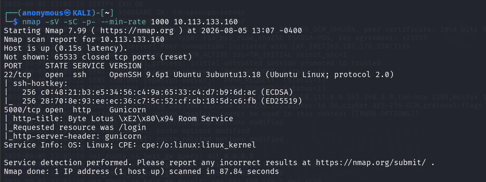
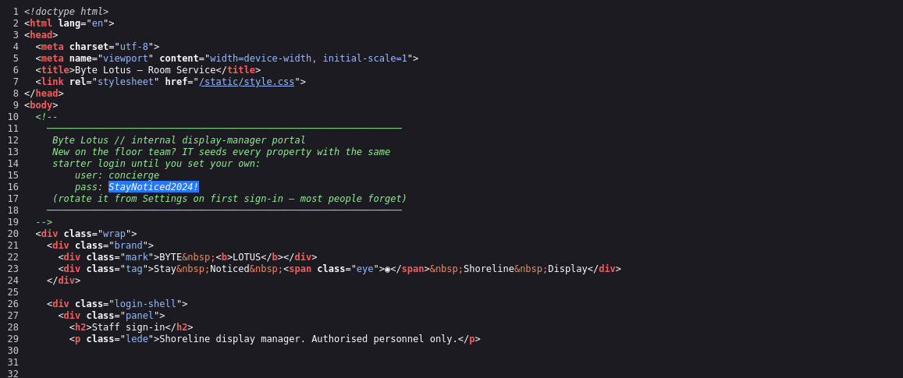
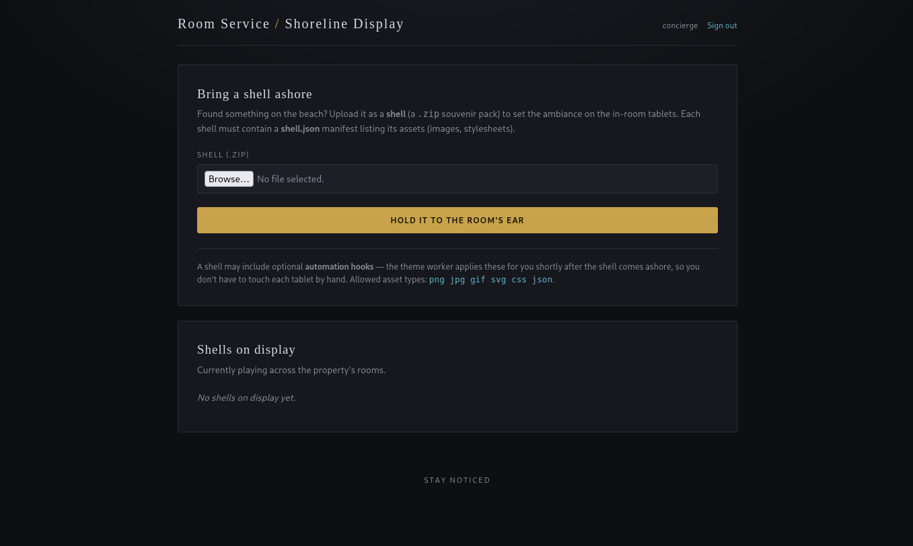
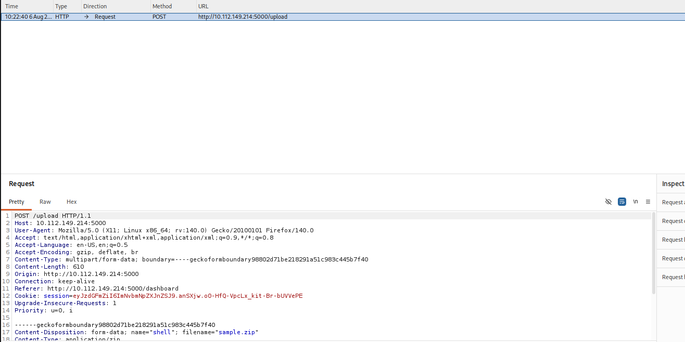
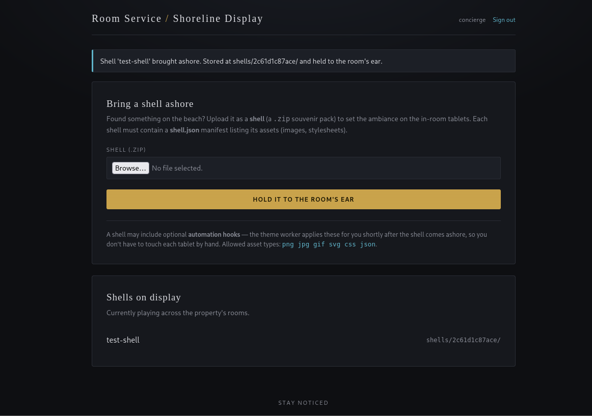
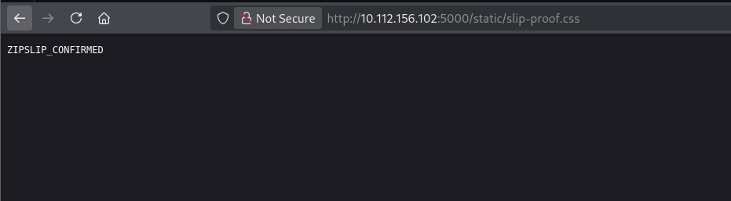
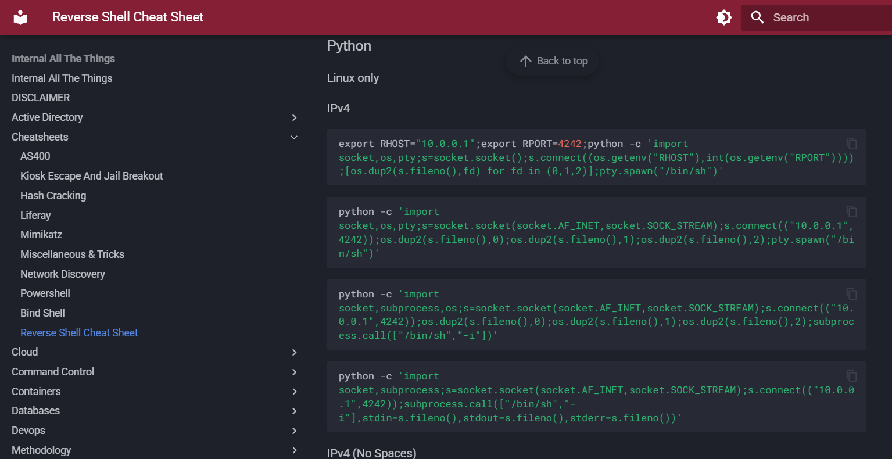
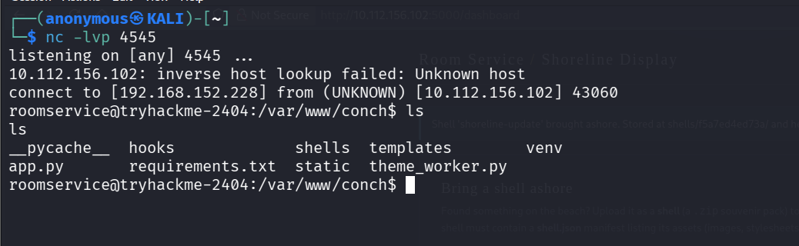
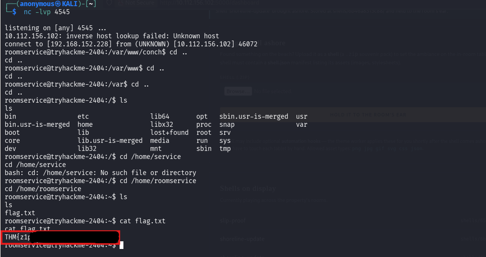

# The Hollow Shell

Byte Lotus has a "Shoreline Display" portal where staff upload a `.zip` "shell" to set the ambiance on the in-room tablets. The whole thing turns out to be a classic Zip Slip: the app trusts whatever path is inside the zip when it extracts it, so a filename like `../../hooks/callback.py` walks straight out of the shell's own folder and into the app root. Combine that with the app's own "automation hooks" feature — a background worker that picks up and runs anything dropped in `hooks/` and you've got remote code execution from a file upload.

## Recon

Started with a full port scan.

    nmap -sV -sC -p- --min-rate 1000 10.113.133.160

SSH on 22, and the app itself on 5000 running under Gunicorn — "Byte Lotus — Room Service", redirecting to /login.

## Finding the login

Opened the login page and checked the source.

    view-source:http://10.113.133.160:5000/login

Right there in an HTML comment default seeded creds for new staff, concierge / StayNoticed2024!, with a note that most people forget to rotate them. Logged in with those through the browser and landed on a clean dashboard, no shells uploaded yet.

## Poking the upload

The portal takes a `.zip` containing a `shell.json` manifest plus whatever assets it lists (png/jpg/gif/svg/css/json). Before touching anything malicious I put together a harmless sample — just a manifest and a stylesheet and watched the upload go through Burp.

Plain multipart POST to /upload, cookie-based session, nothing unusual. Forwarded it and the dashboard confirmed the shell landed and got stored under its own shells/<id>/ folder.

## Zip Slip

This app's exact bug is written up well here: https://security.snyk.io/research/zip-slip-vulnerability — the short version is that if the extraction code trusts the filenames stored inside a zip, a name like `../../static/proof.css` walks the extraction straight back out of the folder it's supposed to be confined to. Nothing in this app's upload handler stops that.

Proved it the safe way first a zip whose only "malicious" part was a manifest plus a stylesheet named with a `../../static/` prefix. Uploaded it the same way as before and went straight to the URL it should land on if the traversal worked.

    http://10.112.156.102:5000/static/slip-proof.css

That's the traversal confirmed a file that should've been stuck inside a shell's own folder ended up sitting in the app's real static/ directory instead.

## From file write to a shell

The dashboard mentions the shell format can include "automation hooks" that a theme worker applies shortly after upload a separate background process that clearly executes something out of a `hooks/` folder. Same zip slip technique, just pointed at `../../hooks/` instead of `../../static/`, with a Python reverse shell payload as the file content. Grabbed the actual payload from the reverse shell cheatsheet here: https://swisskyrepo.github.io/InternalAllTheThings/cheatsheets/shell-reverse-cheatsheet/

Started a listener first.

    nc -lvp 4545

Then uploaded the shell through the browser the same way as every other one. A few seconds later the theme worker picked up the hook and ran it.

Landed as roomservice, straight into the app's own working directory you can see app.py, hooks/, static/, templates/, and theme_worker.py sitting right there, which lines up exactly with what we'd guessed from the upload flow.

## Flag

    cd /home/roomservice
    ls
    cat flag.txt

    THM{z1p_sl1p******************}

